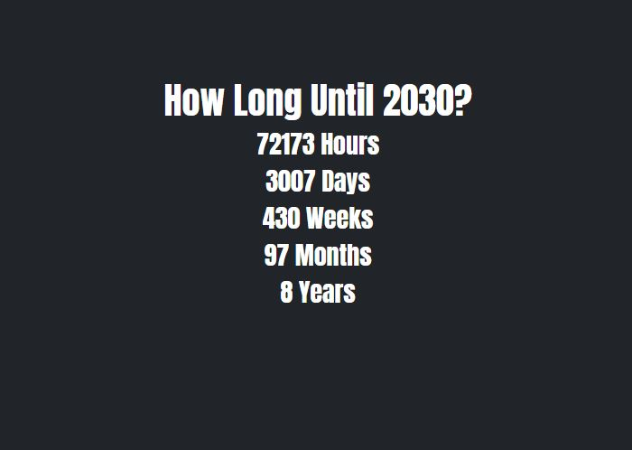

# Countdown Until 2030

From the current date, this application will calculate how long it will take to reach January 1st, 2030. 
The units of time are calculated by hours, days, weeks, months, and years. 

## Screenshot
Screenshot taken on 10/7/21

  
## Technolgies and Frameworks Used

- Boostrap 5.0.2 
- HTML 
- CSS
- VanillaJS 

  
